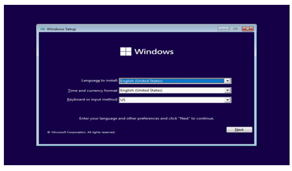
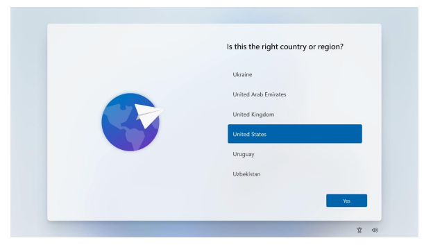
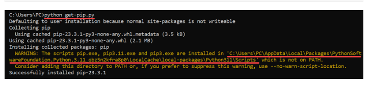

# Dev_Setup
Setup Development Environment

#Assignment: Setting Up Your Developer Environment

#Objective:
This assignment aims to familiarize you with the tools and configurations necessary to set up an efficient developer environment for software engineering projects. Completing this assignment will give you the skills required to set up a robust and productive workspace conducive to coding, debugging, version control, and collaboration.

#Tasks:

1. Select Your Operating System (OS):
   Choose an operating system that best suits your preferences and project requirements. Download and Install Windows 11. https://www.microsoft.com/software-download/windows11

Prior to installing any operating system, it is important to make sure BIOS
recognizes the storage devices appropriately.  BIOS help you see the type of drive(s) you want  intending to use.  

Obtain a copy of the Windows 11 installation media. If the Windows 11 media is an .iso image extract the .iso image to the root of a freshly formatted FAT32 USB memory key.
Insert the USB memory key into one of the USB ports on the system and
power on the system.
At the laptop splash screen, press the function F12 key to enter the BIOS
startup menu and select the USB installation media from the list. 

 The Windows 11 setup screen will show. At the Windows 11 setup screen, select the Language, Time and Keyboard Layout from the dropdown menus and select ‘Next’. 

 

 Select ‘Install now’.

 

 Multiple Windows 11 version operating system media, select the typeof Windows 11 operating system to install.

Check the box next to “I accept the license terms” and select ‘Next’

To upgrade to Windows 11 from an earlier version of Windows, select the “Upgrade” option below.
To perform a clean OS installation, select “Custom: Install Windows only (advanced)” option below. 

Select the drive to install the operating system on from the list below and select ‘Next’. 

The Windows 11 operating system will begin to install

After the installation completes, the system should automatically reboot and Windows 11 home setup will appear.

Choose the rihgt country or region and click "`Next".

Select the appropriate keyboard layout from the list on the next user interface.

Select an optional second keyboard layout or ‘Skip’ on the next interface.

Connect to a network or select “I don’t have internet”.

With no internet connection, select ‘Continue with limited setup’ on the next interface.

Input a name for the PC.

Create a password or leave blank to continue with no password.

Choose the appropriate privacy settings and select ‘Next’ on the following interface and Choose the appropriate privacy settings and select ‘Accept’. 

Windows 11 desktop screen.

Your Windows 11 installation and setup would be done. 

2. Install a Text Editor or Integrated Development Environment (IDE):
   Select and install a text editor or IDE suitable for your programming languages and workflow. Download and Install Visual Studio Code. https://code.visualstudio.com/Download

Open a web browser and go to code.visualstudio.com.
Choose and download the version for your operating system. Visual Studio Code supports Windows, Linux, and macOS. Once downloaded, double click on the app icon and run the installer.

Click on your installer to start installing.

Once the installer launches, step through the installation process. First, accept the License Agreement, then click "I accept the agreement".

Accept the default location for installation by clicking "Next".

Accept the default Start Menu folder name by clicking "Next".

Confirm the installation options, then click "Install"

The installation will proceed.

Click Finish to exit the installation and (by default) launch Visual Studio Code:

The Visual Studio Code installer will create an icon in the ⊞ Start Menu. To locate it, click on the Start Menu and search for 'Code':

Visual Studio Code will launch.

3. Set Up Version Control System:
   Install Git and configure it on your local machine. Create a GitHub account for hosting your repositories. Initialize a Git repository for your project and make your first commit. https://github.com

INSTALLATION & GUIS
With platform-specific installers for Git, GitHub offers a graphical user interface for daily engagement, review, and repository synchronization in addition to making it simple to keep current with the most recent iterations of the command line tool.

GitHub for Windows
htps://windows.github.com

Open Command Propmpt on the windows button/ applications and run the Command Propmt as an Administrator.

Configuring user information used across all local repositories
git config --global user.name “[firstname lastname]”
set a name that is identifiable for credit when review version history
git config --global user.email “[valid-email]”
set an email address that will be associated with each history marker
git config --global color.ui auto

SETUP & INIT
Configuring user information, initializing and cloning repositories
git init
initialize an existing directory as a Git repository
git clone [url]
retrieve an entire repository from a hosted location via URL

4. Install Necessary Programming Languages and Runtimes:
  Instal Python from http://wwww.python.org programming language required for your project and install their respective compilers, interpreters, or runtimes. Ensure you have the necessary tools to build and execute your code.

Download the Python Installer
Go to the official website of Python – Python download page for Windows.

Click on the latest version of Python for Windows. Click the appropriate link for your system to download the executable file: Windows installer (64-bit) or Windows installer (32-bit).

After the installer is downloaded, double-click the .exe file, for example, “python-3.11.2-amd64 .exe“, to run the Python installer.

If you want to save the installation file in a different location, click on Customize installation; otherwise, continue with Install Now.

Once the installation is complete, the pop-up box will appear, "Setup was successful". Click "Close" to end the setup.

5. Install Package Managers:
   If applicable, install package managers like pip (Python).

   Open bash interface and run it as an administrator.

   Type "$ python --version" and press enter to make sure the latest python is installed.

   if the latest python is installed, type "python get-pip.py." and press enter.
    
    

To test whether the installation was successful, type "python -m pip help"

6. Configure a Database (MySQL):
   Download and install MySQL database. https://dev.mysql.com/downloads/windows/installer/5.7.html

MySQL Community Edition is a freely downloadable version of the world's most popular database server. For latest version, choose MySQL download page and use the latest version.
The version I downloaded was MySQL Community Server Installer for Windows (x86, 32-bit).

After the installer appears, Tick the box on the license agreement and click Next to continue

Choose a Setup Type - Developer Default, Server only, selected 'Server only'.

Your databases' and tables' data are kept in the Data Directory. Storing data on a different drive or folder that is readily backed up is always a smart idea. The reason the installation offered a path in conflict that isn't visible in Windows Explorer could be that the folder is a system folder that Windows has hidden.

MySQL Server latest version will be installed and  is ready to be download components.

Choose Standard MySQL Server click Next to continue.

On the network setup Accept the default values and continue to next.

Accept the default Authentication values and continue to next.

Accounts and Roles, Create Root account password. You can skip the User Accounts at this stage if you want.

Accept the default values and continue on Windows service configuration.

Apply configuration and click "Finish"

7. Set Up Development Environments and Virtualization (Optional):
   Consider using virtualization tools like Docker or virtual machines to isolate project dependencies and ensure consistent environments across different machines.

Open bash terminal and run it as an administrator.
Nevigate to the desired forlder/ repository on your local machine and create a folder using "mkdiv" command  and the folder_name 

8. Explore Extensions and Plugins:
   Explore available extensions, plugins, and add-ons for your chosen text editor or IDE to enhance functionality, such as syntax highlighting, linting, code formatting, and version control integration.

9. Document Your Setup:
    Create a comprehensive document outlining the steps you've taken to set up your developer environment. Include any configurations, customizations, or troubleshooting steps encountered during the process. 

#Deliverables:
- Document detailing the setup process with step-by-step instructions and screenshots where necessary.
- A GitHub repository containing a sample project initialized with Git and any necessary configuration files (e.g., .gitignore).
- A reflection on the challenges faced during setup and strategies employed to overcome them.

#Submission:
Submit your document and GitHub repository link through the designated platform or email to the instructor by the specified deadline.

#Evaluation Criteria:**
- Completeness and accuracy of setup documentation.
- Effectiveness of version control implementation.
- Appropriateness of tools selected for the project requirements.
- Clarity of reflection on challenges and solutions encountered.
- Adherence to submission guidelines and deadlines.

Note: Feel free to reach out for clarification or assistance with any aspect of the assignment.
